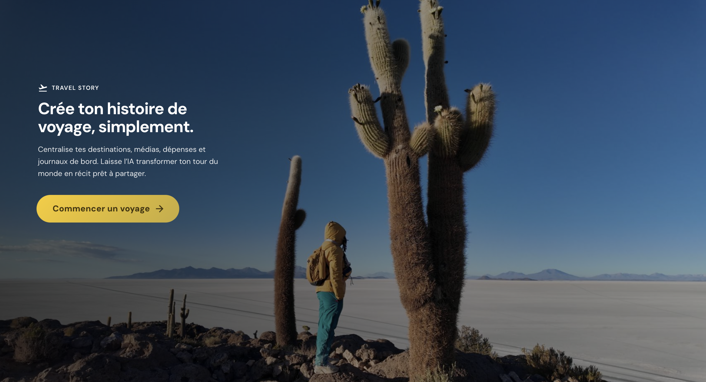
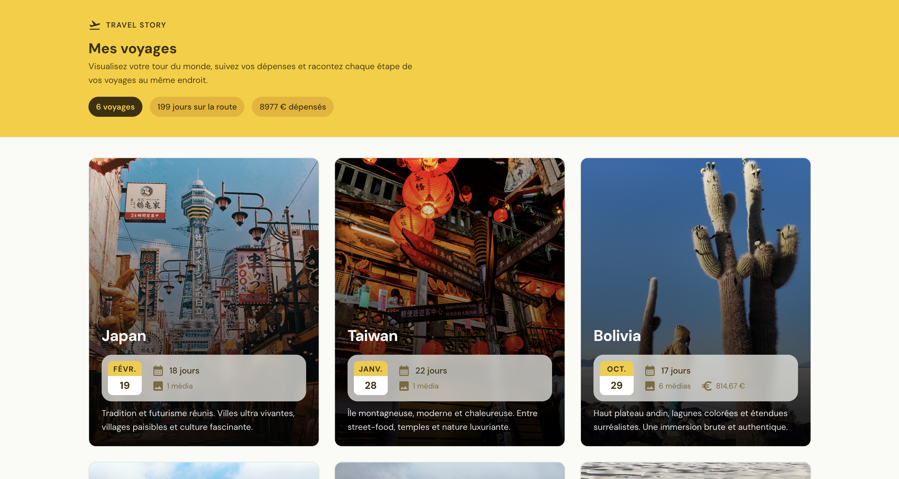
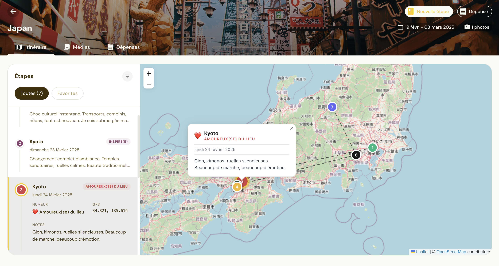
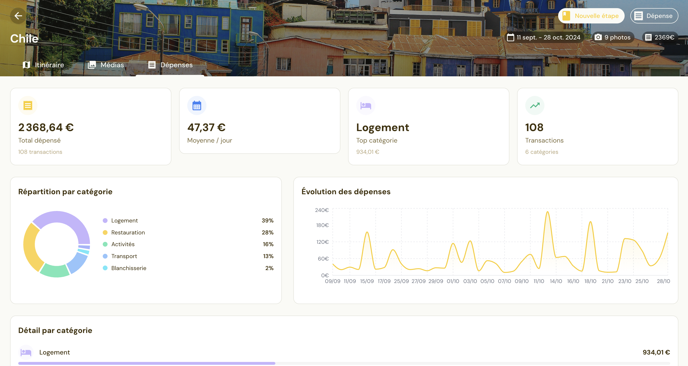
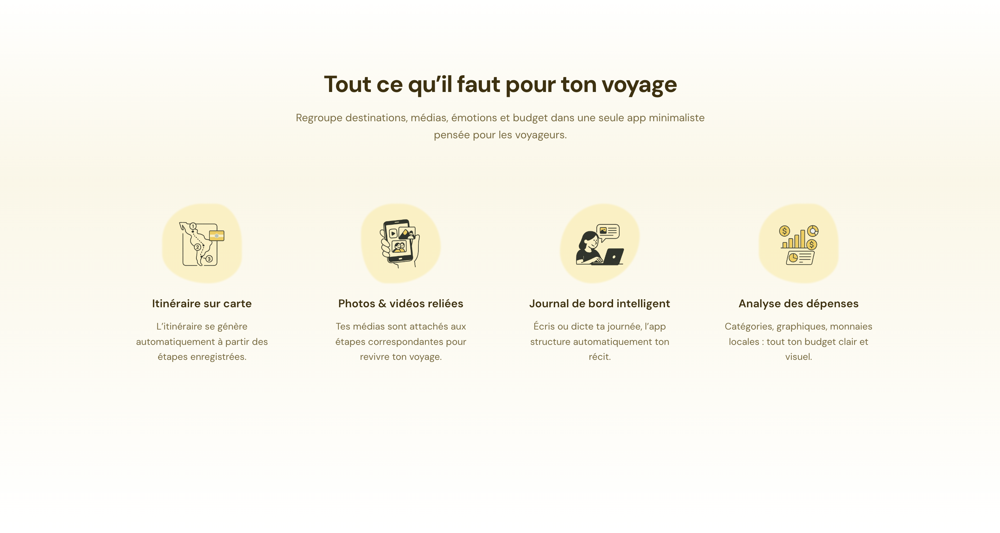

# 🌍 Travel Story Maker

> A minimalist travel journaling & storytelling app built with **Next.js**, **Supabase**, **MUI**, and optional **AI-powered** features.

Travel Story Maker centralizes destinations, media, expenses, and daily notes — and transforms your journey into a structured, visual story.

---



---

## ✨ Features

### 🗺️ Global Trip Overview
Create trips by country, set dates, moods, and descriptions, and view instant statistics (days, photos, videos, expenses, journal entries).

### 📍 Interactive Map & Journal
Each entry appears as a marker on the map. Selecting a marker scrolls to the timeline entry, and vice‑versa.

### 🖼️ Media Management (Photos & Videos)
Upload photos and videos, extract metadata (EXIF, geolocation), and connect them to specific days or locations.

### 📝 Intelligent Travel Journal
Write or record your day — audio uploads are transcribed into text automatically.

### 💸 Expense Tracking
Import expenses from CSV, categorize them, view totals by category, by trip, and across currencies.

### 🤖 AI‑Generated Stories
Automatically generate summaries, reel scripts, captions, and travel reviews based on your real data.

### 🎨 Clean, Modern Landing Page
Fullscreen hero, animated CTA, custom illustrations, horizontal timeline, and Apple‑inspired minimalism.

---

# 📸 Screenshots

### 🏔️ Home & Hero


### 🗺️ Trip Details & Map


### 📝 Journal & Timeline


### 📸 Media Gallery


### 💸 Expenses Dashboard


### 🎨 Features Section


### 🔄 How It Works Timeline


---

## 🧱 Tech Stack

- **Framework**: Next.js (App Router)
- **Language**: TypeScript
- **UI Library**: Material UI (MUI) with a fully custom theme
- **Backend**: Supabase (PostgreSQL, Auth, Storage)
- **Styling**: MUI theme tokens + global CSS
- **Maps**: Leaflet (dynamic import)
- **AI**: Optional OpenAI integration
- **Tooling**: pnpm, ESLint, Prettier

---

## 🗄️ Database Structure (Simplified)

- `trips` — main trip metadata
- `journal_entries` — daily logs
- `media_assets` — photos/videos + metadata
- `expenses` — categorized spending
- `stories` — AI‑generated content
- `reels` — future automated video generation

---

## 🚀 Getting Started

### 1. Clone the project

```bash
git clone <your_repo_url>
cd travel-story-maker
```

### 2. Install dependencies

```bash
pnpm install
```

### 3. Create environment variables

```env
NEXT_PUBLIC_SUPABASE_URL=<your_supabase_url>
NEXT_PUBLIC_SUPABASE_ANON_KEY=<your_supabase_anon_key>

# Optional AI key
OPENAI_API_KEY=<your_openai_key>
```

### 4. Start the dev server

```bash
pnpm dev
```

Then open:
➡ `http://localhost:3000`

---

## 🔧 Scripts

The project includes Node scripts (`.mjs`) for:

- Importing Polarsteps JSON
- Seeding journal entries
- Matching GPS coordinates
- Importing expenses from CSV
- Linking media to journal entries

Run a script with:

```bash
node scripts/<script-name>.mjs
```

---

## 📁 Project Structure

```
src/
  app/
    page.tsx
    trips/
      page.tsx
      [id]/
        page.tsx
  components/
    hero/
    features/
    how-it-works/
    trips/
    common/
  lib/
    supabase/
    utils/
    hooks/
  styles/
    theme.ts
    tokens.ts
    globals.css

public/
  screenshots/
    hero.png
    home.png
    trip-details.png
    journal.png
    media.png
    expenses.png
    features.png
    timeline.png

scripts/
```

---

## 🧭 Roadmap

- Automated reel creation
- Public sharing pages
- Global travel dashboards
- Offline/PWA mode
- AI itinerary review & travel advice

---

## 🤝 Contributing

This project is a portfolio showcase & personal travel tool.
Contributions, improvements, or feature ideas are welcome.

---

## 📄 License

**All Rights Reserved.**

This project and its source code may not be copied, modified, published, distributed, or reused without explicit permission from the author.

© 2025 Kaniba Keita — All Rights Reserved.
